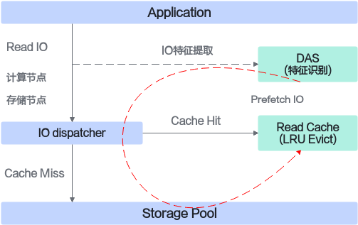

# README<a name="ZH-CN_TOPIC_0000002552555187"></a>

## 项目介绍<a name="ZH-CN_TOPIC_0000002551607163"></a>

### 简介<a name="ZH-CN_TOPIC_0000002521150450"></a>

Ucache智能读缓存通过I/O智能预取精准识别热点请求，并针对顺序、间隔等I/O流进行I/O预取，将I/O提前载入读缓存。通过LRU算法淘汰冷数据，Ucache读缓存能够提高缓存的I/O命中率，提升读性能。

Ucache智能读缓存的工作原理如下图所示。

- Application下发I/O请求时将I/O特征输入DAS数据智能分析引擎。
- DAS数据智能分析引擎针对I/O流进行模型识别，从而对I/O进行预测，输出预取I/O Pattern。

- Read Cache利用高速存储介质（如NVMe）提供数据缓存能力，维护缓存数据与主存数据的映射关系，针对缓存数据进行热点识别，并通过LRU算法淘汰冷数据，从而维持高缓存命中率。

    

> **说明：**
> 
>DAS数据智能分析引擎功能在KSAL动态库里实现，关于DAS集成的相关接口说明请参考《Kunpeng BoostKit 24.0.RC2 分布式存储加速算法库 开发指南》中[DAS接口](https://www.hikunpeng.com/document/detail/zh/kunpengsdss/basicAccelFeatures/ksal/kunpengksal_16_0027.html)，本文主要对读缓存库的实现和安装进行说明。

### 其他信息<a name="ZH-CN_TOPIC_0000002521310452"></a>

Ucache主要针对混闪场景（后端HDD+缓存NVMe），适用于对读性能提升有诉求的场景。

Ucache基于开源ocf进行开发，ocf本身是一个使用高性能存储设备加速后端块存储I/O访问的缓存引擎，需要应用实现适配层配置。

Lava场景要在服务侧集成一个读缓存，基于ocf实现读缓存模块的方案如下：

- Lava本身就是一套完整的存储解决方案，只是在服务侧提供一个读缓存模块，不需要完整的集成整套ocf框架，只需复用cache和主存数据的映射算法、淘汰算法等部分逻辑，其它功能可进行选择性裁剪。
- 针对Lava的结构，新增适配层。传入的I/O保留slot、region等信息，适配层自动完成lava\_io到ocf\_io的转化，方便lava系统快速集成。
- 读缓存的数据读写需要Lava系统提供块读写接口。Lava的chunk层提供NVMe介质的chunk pool，以及chunk读写异步接口。

## 目录结构<a name="ZH-CN_TOPIC_0000002551630439"></a>

```txt
├── docs                            # 项目文档目录
│   ├── LICENSE                     # 文档许可协议
│   └── zh                          # 中文文档目录
│       ├── figures                 # 中文文档图片资料目录
│       ├── public_sys-resources    # 中文公共资源目录
│       ├── api_reference.md        # API指南
│       ├── installation_guide.md   # 安装指南
│       └── release_notes.md        # 版本说明书
├── ucache.patch                    # UCache补丁文件
├── LICENSE                         # 软件许可协议
└── README.md                       # 介绍文档
```

## 版本说明<a name="ZH-CN_TOPIC_0000002551510455"></a>

版本信息详见《[版本说明书](docs/zh/release_notes.md)》。

## 环境部署<a name="ZH-CN_TOPIC_0000002552229815"></a>

环境要求、编译特性指南详见《[安装指南](docs/zh/installation_guide.md)》。

## 开发指南<a name="ZH-CN_TOPIC_0000002551632355"></a>

接口、结构体、错误码等定义详见《[API指南](docs/zh/api_reference.md)》。

## 免责声明<a name="ZH-CN_TOPIC_0000002520632364"></a>

**致本项目使用者**

- 本项目仅供调试和开发之用，使用者需自行承担使用风险，并理解以下内容：
    - 数据处理及删除：用户在使用本工具过程中产生的数据属于用户责任范畴。建议用户在使用完毕后及时删除相关数据，以防信息泄露。
    - 数据保密与传播：使用者了解并同意不得将通过本工具产生的数据随意外发或传播。对于由此产生的信息泄露、数据泄露或其他不良后果，本工具及其开发者概不负责。
    - 用户输入安全性：用户需自行保证输入的命令行的安全性，并承担因输入不当而导致的任何安全风险或损失。对于输入命令行不当所导致的问题，本工具及其开发者概不负责。

- 免责声明范围：本免责声明适用于所有使用本工具的个人或实体。使用本工具即表示您同意并接受本声明的内容，并愿意承担因使用该功能而产生的风险和责任，如有异议请停止使用本工具。
- 在使用本工具之前，请**谨慎阅读并理解以上免责声明的内容**。对于使用本工具所产生的任何问题或疑问，请及时联系开发者。

**致数据所有者**

如果您不希望您的模型或数据集等信息在本项目中被提及，或希望更新本项目有关的描述，请在GitCode提交issue，我们将根据您的issue要求删除或更新您相关描述。衷心感谢您对本项目的理解和贡献。

## License<a name="ZH-CN_TOPIC_0000002520472368"></a>

本项目的代码适用于BSD-3-Clause许可证，具体请参见[LICENSE文件](LICENSE)。

本项目的文档适用于CC-BY 4.0许可证，具体请参见[LICENSE文件](docs/LICENSE)。

## 贡献声明<a name="ZH-CN_TOPIC_0000002551512355"></a>

欢迎大家为社区做贡献，如果使用过程中有任何问题/建议，或者需要反馈特性需求和bug报告，可以提交[Issues](https://gitcode.com/boostkit/community/blob/master/docs/contributor/issue-submit.md)联系我们，具体贡献方法可参考[这里](https://gitcode.com/boostkit/community/blob/master/docs/contributor/contributing.md)。同时也欢迎大家在[讨论专区](https://gitcode.com/boostkit/community/discussions)展开讨论交流。感谢您的支持。
