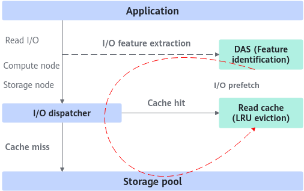

# README<a name="EN-US_TOPIC_0000002552555187"></a>

## Project Introduction<a name="EN-US_TOPIC_0000002551607163"></a>

### Introduction<a name="EN-US_TOPIC_0000002521150450"></a>

The Ucache smart read cache uses smart I/O prefetch to accurately identify hotspot requests, prefetch I/Os of the sequential pattern, interval pattern and more, and load I/Os to the read cache in advance. In addition, it uses the LRU algorithm to evict cold data, improving the I/O hit ratio and read performance.

The following figure shows the working principle of the Ucache smart read cache.

- When an application delivers I/O requests, the I/O features are input to the DAS engine.
- The DAS engine identifies the I/O patterns, predicts I/Os, and outputs the pattern of I/Os to be prefetched.

- The read cache uses high-speed media (such as NVMe drives) to cache data. It maintains the mapping between cached data and data in main storage, identifies hotspot data from cached data, and uses the LRU algorithm to evict cold data, improving the cache hit ratio.

    

> **NOTE**
> 
>The DAS intelligent data analysis engine is implemented in the KSAL dynamic library. For details about interfaces integrated for DAS, see [DAS Interfaces](https://www.hikunpeng.com/document/detail/en/kunpengsdss/basicAccelFeatures/ksal/kunpengksal_16_0027.html) in *Kunpeng BoostKit 24.0.RC2 KSAL Developer Guide*. This document describes the implementation and installation of the read cache library.

### Other Information<a name="EN-US_TOPIC_0000002521310452"></a>

Ucache is suitable for hybrid-flash storage (HDD backend storage + NVMe cache) where the read performance needs to be improved.

Ucache is developed based on the open-source OCF. OCF is a cache engine that uses high-performance storage devices to accelerate backend block storage I/O access. The adaptation layer needs to be configured for applications.

In the Lava scenario, to integrate read cache on servers, refer to the following solution of implementing the read cache module based on OCF:

- Lava is a complete storage solution. Read cache integration on servers does not require the integration of the entire OCF framework. Only some algorithm logic such as the mapping between cached data and data in main storage as well as data eviction needs to be reused. Other functions can be cropped as required.
- An adaptation layer needs to be added for Lava. Reserve information such as slots and regions of input I/Os. The adaptation layer automatically converts lava\_io to ocf\_io, facilitating quick integration with the Lava system.
- To read and write data in the read cache, the Lava system needs to provide block read and write interfaces. The chunk layer of Lava provides NVMe chunk pools and asynchronous chunk read/write interfaces.

## Directory structure<a name="EN-US_TOPIC_0000002551630439"></a>

```txt
├── docs                            # Project documentation
│   ├── LICENSE                     # Document license
│   └── en                          # Document directory
│       ├── figures                 # Figure resources
│       ├── public_sys-resources    # Public system resources
│       ├── api_reference.md        # API reference
│       ├── installation_guide.md   # Installation guide
│       └── release_notes.md        # Release notes
├── ucache.patch                    # UCache patch file
├── LICENSE                         # Software license
└── README.md                       # Project introduction
```

## Version Description<a name="EN-US_TOPIC_0000002551510455"></a>

For details about the version information, see [Release Notes](docs/en/release_notes.md).

## Environment Deployment<a name="EN-US_TOPIC_0000002552229815"></a>

For details about the environment requirements and feature compilation, see [Installation Guide](docs/en/installation_guide.md).

## Developer Guide<a name="EN-US_TOPIC_0000002551632355"></a>

For details about the definitions of interfaces, structures, and error codes, see [API Reference](docs/en/api_reference.md).

## Disclaimer<a name="EN-US_TOPIC_0000002520632364"></a>

**To Users of This Project**

- This project is intended solely for debugging and development. You are responsible for any risks and should carefully review the following information:
    - Data processing and deletion: Users are responsible for managing and deleting any data generated while using this tool. Users are advised to delete such data promptly after use to prevent information leakage.
    - Data confidentiality and transmission: Users understand and agree not to share or transmit any data generated by this tool. Neither the tool nor its developers are responsible for any information leaks, data breaches, or other negative consequences.
    - User input security: Users are responsible for the security of any commands they enter and for any risks or losses resulting from improper input. The tool and its developers are not liable for issues caused by incorrect command usage.

- Disclaimer scope: This disclaimer applies to all individuals and entities using this tool. By using the tool, you acknowledge and accept this statement and assume all risks and responsibilities arising from its use. If you do not agree, please stop using the tool immediately.
- Before using this tool, please **read and understand the preceding disclaimer**. If you have any questions, contact the developer.

**To Data Owners**

If you do not want your model or dataset to be mentioned in this project, or if you wish to update its description, please submit an issue on GitCode. We will delete or update your description according to your request. Thank you for your understanding and contribution to this project.

## License<a name="EN-US_TOPIC_0000002520472368"></a>

The code of this project is licensed under BSD-3-Clause. For details, see [LICENSE](LICENSE).

The documents of this project are licensed under CC-BY 4.0. For details, see [LICENSE](docs/LICENSE).

## Contribution Statement<a name="EN-US_TOPIC_0000002551512355"></a>

We welcome your contributions to the community. If you have any questions/suggestions or want to provide feedback on feature requirements and bug reports, you can submit [issues](https://gitcode.com/boostkit/community/blob/master/docs/contributor/issue-submit.md). For details, see [Contribution Guideline](https://gitcode.com/boostkit/community/blob/master/docs/contributor/contributing.md). You are also welcome to share insights in [Discussions](https://gitcode.com/boostkit/community/discussions). Thank you for your support.
