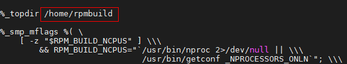
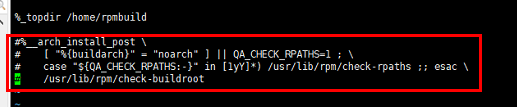
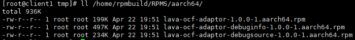
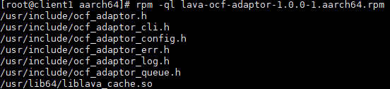

# 安装指南<a name="ZH-CN_TOPIC_0000002552472695"></a>

## 特性描述<a name="ZH-CN_TOPIC_0000002551640122"></a>

Ucache智能读缓存通过I/O智能预取精准识别热点请求，并针对顺序、间隔等I/O流进行I/O预取，将I/O提前载入读缓存。通过LRU算法淘汰冷数据，Ucache读缓存能够提高缓存的I/O命中率，提升读性能。

## 环境要求<a name="ZH-CN_TOPIC_0000002551640121"></a>

本文基于鲲鹏服务器和openEuler操作系统提供指导，在正式操作前请确保软硬件均满足要求。

**硬件要求<a name="zh-cn_topic_0000001217080138_section10273165810425"></a>**

| 项目    | 描述         |
|-------|------------|
| CPU型号 | 华为鲲鹏920处理器 |

**软件要求<a name="section1240364411598"></a>**

| 项目     | 描述                      |
|--------|-------------------------|
| 操作系统   | <ul><li>openEuler 20.03 LTS SP1</li><li>openEuler 22.03 LTS SP1</li></ul> |
| Ucache | 1.0.0                   |

> **说明：** 
>Ucache基于开源ocf进行开发，可以在[这里](https://gitcode.com/boostkit/ocf/tree/dev-UCache)获取源码。
>
## 编译安装读缓存库<a name="ZH-CN_TOPIC_0000002520640142"></a>

1. 下载ocf仓库代码，使用UCache补丁，并打包。

    ```sh
    cd /home
    git clone https://github.com/Open-CAS/ocf.git
    cd ocf
    git checkout d1d6d7cb5f55b616d2aa5123f84ce4ece10fdb0b
    wget https://gitcode.com/boostkit/ocf/blob/master/ucache.patch
    git apply ucache.patch
    cd ..
    tar -zcvf lava-ocf-adaptor-1.0.0.tar.gz ocf/
    ```

2. 进入`/home`目录，重新生成RPMbuild目录。

   1. 环境需要先安装rpmbuild工具

     ```sh
     yum install rpm-build
     ```

   1. 修改`.rpmmacros`文件。

        ```sh
        vi /root/.rpmmacros
        ```

   2. 修改`%_topdir`的路径为`/home/rpmbuild`。若文件不存在，则新增一行保存退出。

        

   3. 再次执行rpmbuild安装命令。

        ```sh
        rpmdev-setuptree
        ```

3. 修改rpmmacros文件，注释掉下面红框中的内容。

    ```sh
    vi /root/.rpmmacros
    ```

    

4. 将源码压缩包和spec文件拷贝到`/home/rpmbuild`子目录中。

    ```sh
    cp /home/lava-ocf-adaptor-1.0.0.tar.gz /home/rpmbuild/SOURCES
    cp /home/ocf/lava-ocf-adaptor.spec /home/rpmbuild/SPECS
    ```

5. 编译rpm包。

    默认出包命令：

    ```sh
    rpmbuild -bb /home/rpmbuild/SPECS/lava-ocf-adaptor.spec
    ```

    编译完成会生成如下rpm包。

    

6. 安装rpm包。

    ```sh
    cd /home/rpmbuild/RPMS/aarch64/
    rpm -ivh lava-ocf-adaptor-1.0.0-1.aarch64.rpm
    ```

    安装后，lava-ocf-adaptor-1.0.0-1.aarch64.rpm文件如下：

    

    > **说明：** 
    >所有对外接口及接口说明在`ocf_adaptor.h`中，其他头文件定义一些结构体和错误码。
    >应用程序集成读缓存，编译时，增加链接选项`-llava_cache`即可。

## 修订记录

| 发布日期  | 修改说明       |
|-------|----------|
| 2024-06-30 | 第一次正式发布。 |
